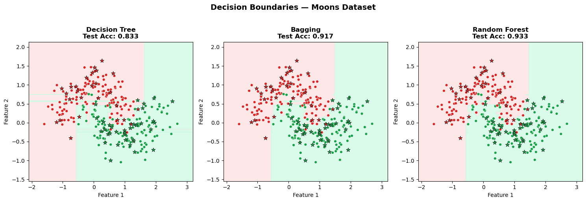
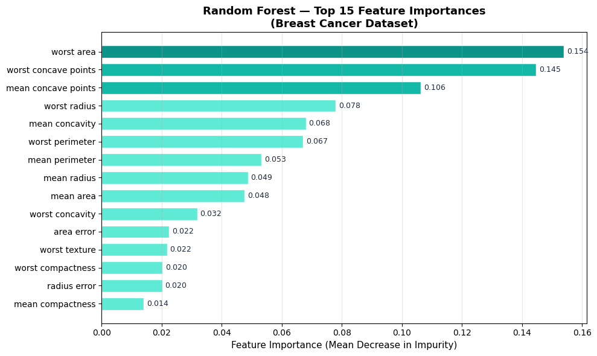
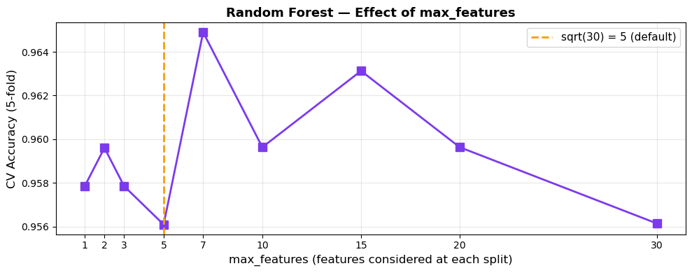
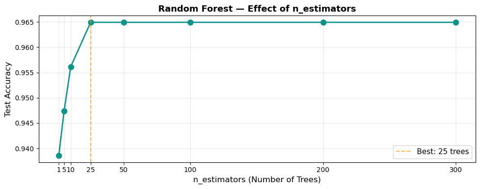
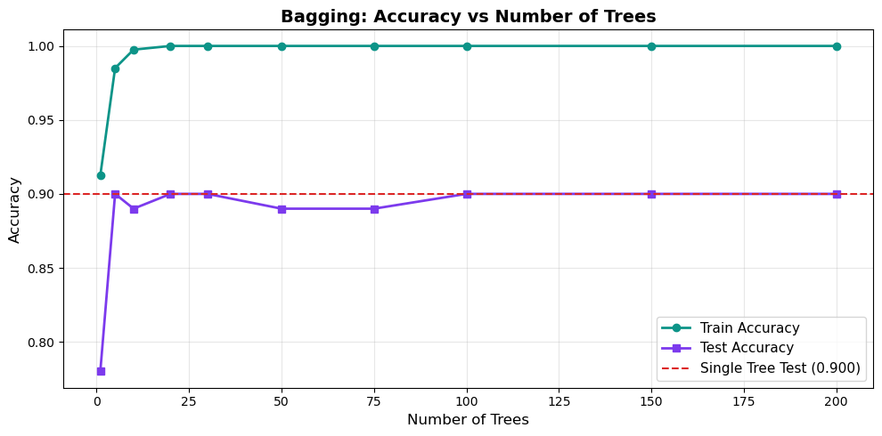

# 🌳 From Bagging to Random Forest

[](https://colab.research.google.com/github/MMujtabaX/Bagging-Random-Forest/blob/main/bagging_random_forest.ipynb)


A hands-on walkthrough of **ensemble learning with trees**. It starts from why a single decision tree overfits, builds bagging from scratch, shows why bagged trees end up correlated, and explains how Random Forest fixes that. Everything is demonstrated in code and verified on a real medical dataset.

<p align="center">
  
</p>

## 📚 What's Covered

| # | Topic | Key idea |
|---|-------|----------|
| 1 | Single-tree overfitting | A fully grown tree hits 100% train accuracy: low bias, high variance |
| 2 | Bootstrap sampling | Sampling with replacement; empirically verifies the **63.2% rule** (1 − 1/e) |
| 3 | Bagging from scratch | A `ManualBagging` class: bootstrap → train trees → majority vote |
| 4 | Convergence | How accuracy stabilizes as trees are added |
| 5 | Correlated trees | Why bagged trees all split on the same strong feature |
| 6 | Random Forest | Random feature subsets at each split **decorrelate** the trees |
| 7 | Real dataset | Tree vs Bagging vs Random Forest on Breast Cancer Wisconsin |
| 8 | Feature importance | Mean Decrease in Impurity (MDI) |
| 9 | Hyperparameters | Effect of `n_estimators` and `max_features` |
| 10 | Out-of-bag score | Free validation from the ~37% of rows each tree never sees |

## ⚠️ The Problem Bagging Can't Solve

With bagging, one strong feature dominates. Across 10 bagged trees, **Feature 0 was the root split in 8 of them**, so the trees make the same mistakes and their errors don't cancel out.

Random Forest considers only a random subset of features at each split. With the same setup, Feature 0 was the root in **just 4 of 10 trees**, and **6 different features** appeared as root splits.

| | Bagging | Random Forest |
|--|---------|---------------|
| Bootstrap sampling | ✅ | ✅ |
| Random feature subset at each split | ❌ | ✅ |
| Tree correlation | High | Low |

## 🔬 Results: Breast Cancer Wisconsin

569 samples, 30 features, malignant vs benign.

| Model | 5-Fold CV Mean | CV Std | Test Accuracy |
|-------|----------------|--------|---------------|
| Decision Tree | 0.917 | 0.024 | 0.947 |
| Bagging (100 trees) | **0.958** | 0.038 | 0.956 |
| **Random Forest (100 trees)** | 0.956 | **0.023** | **0.965** |

Both ensembles improve on a single tree by about **4 points** in cross-validation. Random Forest also has the **lowest variance across folds**, meaning its performance is the most stable.

**OOB score (0.956) closely matched 5-fold CV (0.956)**, which shows that out-of-bag validation is a reliable free estimate.

## 📈 Visualizations

<table>
  <tr>
    <td></td>
    <td></td>
  </tr>
  <tr>
    <td align="center"><b>Top features: <code>worst area</code> leads; top 3 account for 40.5% of importance</b></td>
    <td align="center"><b><code>max_features</code>: √30 ≈ 5 works well; using all 30 = plain bagging</b></td>
  </tr>
  <tr>
    <td></td>
    <td></td>
  </tr>
  <tr>
    <td align="center"><b>Accuracy plateaus after ~100 trees</b></td>
    <td align="center"><b>Bagging convergence as trees are added</b></td>
  </tr>
</table>

## 💡 Key Takeaways

- **Bagging reduces variance** by averaging many trees trained on bootstrap samples.
- **Random Forest reduces correlation** between those trees, so errors cancel out better.
- `max_features` is the most important Random Forest hyperparameter. √(n_features) is a strong default.
- **More trees rarely hurt, but gains plateau.** Start with 100.
- **OOB score** gives a validation estimate with no held-out data, which is especially useful for small datasets.
- On an easy synthetic dataset, ensembles gave no gain over a single tree (all ~0.89–0.90 test accuracy). Their advantage showed up clearly on the real dataset, a reminder to always evaluate with cross-validation rather than one split.

## 🏋️ Practice Exercises

The notebook ends with exercises: set `max_features=1`, turn off bootstrapping (pasting), limit tree depth, and interpret the feature importances medically.

## 🚀 Run It

Click the **Open in Colab** badge above, or run it locally:

```bash
pip install numpy pandas matplotlib scikit-learn jupyter
jupyter notebook bagging_random_forest.ipynb
```

## 👤 Author

**Muhammad Mujtaba Khan Suri** — CS @ UBIT, University of Karachi
[GitHub](https://github.com/MMujtabaX)
